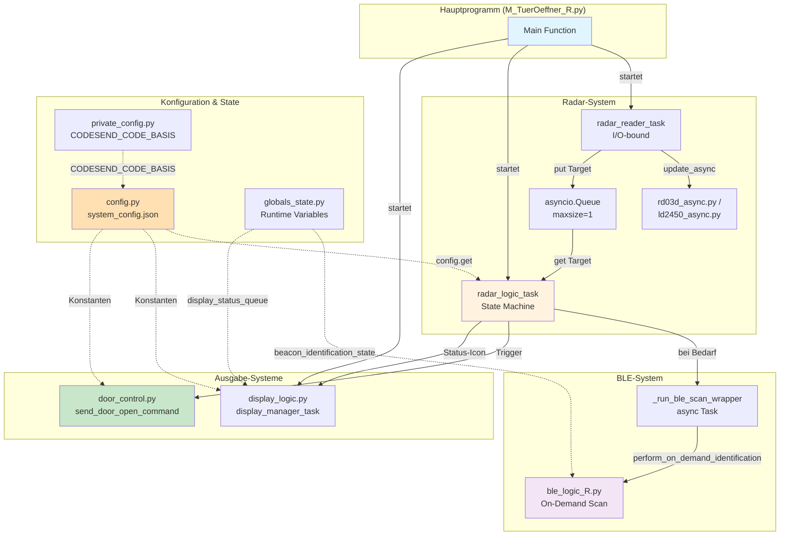
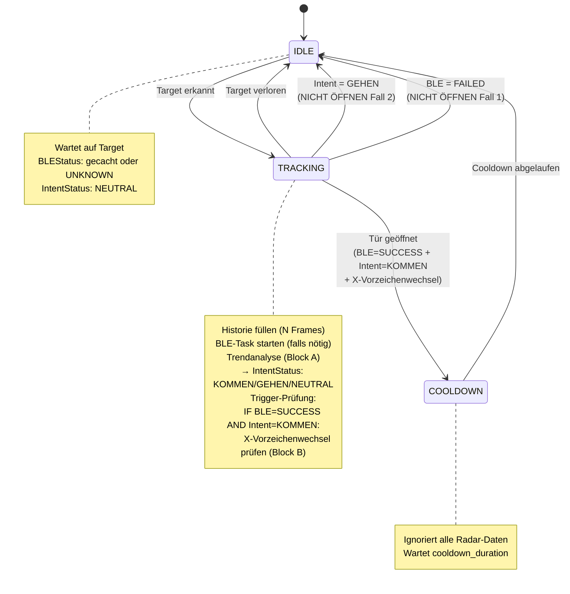
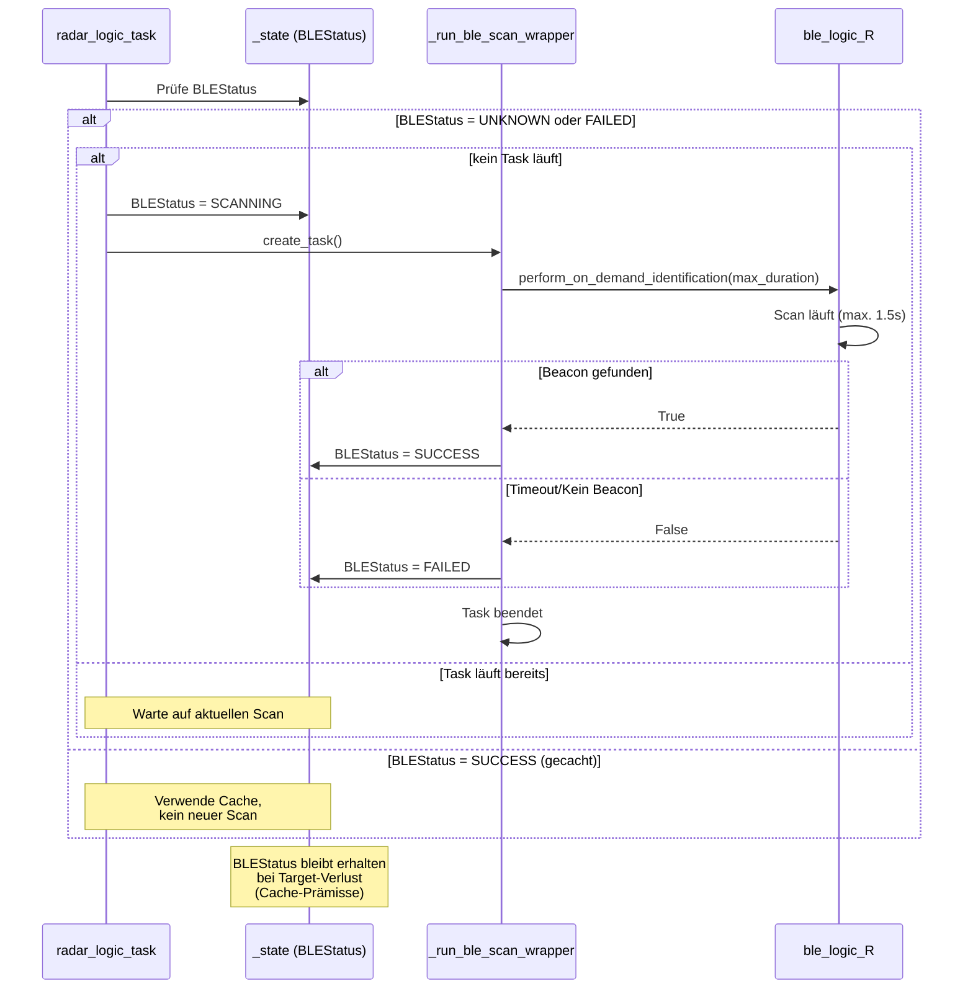
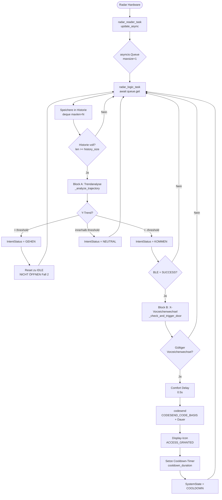

# Türöffnungssystem

**Radargestützte Zugangskontrolle mit BLE-Authentifizierung**

Version 2.0 (Stand: November 2025)

Dr. Ralf Korell

---

# Inhaltsverzeichnis

1. [Systemübersicht](#1-systemübersicht)
   - 1.1 [Zweck und Funktionsweise](#11-zweck-und-funktionsweise)
   - 1.2 [Hardware-Komponenten](#12-hardware-komponenten)
   - 1.3 [Software-Architektur](#13-software-architektur)
2. [Hardware-Setup und physische Geometrie](#2-hardware-setup-und-physische-geometrie)
   - 2.1 [Physische Geometrie und Koordinatensystem](#21-physische-geometrie-und-koordinatensystem)
   - 2.2 [Sensor-Positionierung und Sichtfeld](#22-sensor-positionierung-und-sichtfeld)
3. [Software-Module](#3-software-module)
   - 3.1 [Hauptprogramm (M_TuerOeffner_R.py)](#31-hauptprogramm-m_tueroeffner_rpy)
   - 3.2 [Konfigurationsmodul (config.py)](#32-konfigurationsmodul-configpy)
   - 3.3 [Radar-Logik und State Machine (radar_logic.py)](#33-radar-logik-und-state-machine-radar_logicpy)
   - 3.4 [BLE-Authentifizierung (ble_logic_R.py)](#34-ble-authentifizierung-ble_logic_rpy)
   - 3.5 [Hardware-Treiber (rd03d_async.py / ld2450_async.py)](#35-hardware-treiber-rd03d_asyncpy--ld2450_asyncpy)
   - 3.6 [Weitere Module](#36-weitere-module)
4. [Ablaufbeschreibung](#4-ablaufbeschreibung)
   - 4.1 [System-Lifecycle](#41-system-lifecycle)
   - 4.2 [State Machine Flow (radar_logic_task)](#42-state-machine-flow-radar_logic_task)
   - 4.3 [Radar-Datenverarbeitung (Entkoppelte Tasks)](#43-radar-datenverarbeitung-entkoppelte-tasks)
   - 4.4 [BLE-Authentifizierung (On-Demand mit Caching)](#44-ble-authentifizierung-on-demand-mit-caching)
   - 4.5 [Türöffnungs-Entscheidung (Block A/B Logik)](#45-türöffnungs-entscheidung-block-ab-logik)
5. [Konfiguration](#5-konfiguration)
   - 5.1 [Übersicht Konfigurationsquellen](#51-übersicht-konfigurationsquellen)
   - 5.2 [system_config.json](#52-system_configjson)
   - 5.3 [private_config.py](#53-private_configpy)
   - 5.4 [Hardcoded-Konstanten (config.py)](#54-hardcoded-konstanten-configpy)
   - 5.5 [Web-Konfigurationsoberfläche](#55-web-konfigurationsoberfläche)
6. [Variablen-Referenz](#6-variablen-referenz)
   - 6.1 [Variablen nach Funktion und Wichtigkeit](#61-variablen-nach-funktion-und-wichtigkeit)
   - 6.2 [Variablen nach Wartungsort](#62-variablen-nach-wartungsort)
7. [Flowdiagramme](#7-flowdiagramme)
   - 7.1 [System-Architektur-Übersicht](#71-system-architektur-übersicht)
   - 7.2 [Radar Logic State Machine](#72-radar-logic-state-machine)
   - 7.3 [BLE-Authentifizierungs-Flow](#73-ble-authentifizierungs-flow)
   - 7.4 [Datenfluss Radar → Logik → Türöffnung](#74-datenfluss-radar--logik--türöffnung)
8. [Installation und Betrieb](#8-installation-und-betrieb)
   - 8.1 [Systemanforderungen](#81-systemanforderungen)
   - 8.2 [Installation](#82-installation)
   - 8.3 [Erste Inbetriebnahme](#83-erste-inbetriebnahme)
   - 8.4 [Wartung](#84-wartung)
9. [Fehlersuche und Debugging](#9-fehlersuche-und-debugging)
   - 9.1 [Logging-Levels](#91-logging-levels)
   - 9.2 [Häufige Probleme](#92-häufige-probleme)
   - 9.3 [Bekannte Bugs und Lösungen](#93-bekannte-bugs-und-lösungen)
10. [Anhang](#10-anhang)
    - 10.1 [Glossar](#101-glossar)
    - 10.2 [Änderungshistorie (Auszug)](#102-änderungshistorie-auszug)
    - 10.3 [Code-Konventionen](#103-code-konventionen)

---

# 1. Systemübersicht

## 1.1 Zweck und Funktionsweise

Das Türöffnungssystem ist eine automatisierte Zugangskontrolllösung, die zwei zentrale Authentifizierungsfaktoren kombiniert:

- **Multi-Faktor Radar-basierte Bewegungserkennung** zur Intentionsanalyse
- **BLE-Beacon-Identifikation** zur Personenauthentifizierung

Das System öffnet die Tür nur dann, wenn **BEIDE** Bedingungen erfüllt sind:

- **Intention 'KOMMEN':** Eine Person nähert sich der Tür aus der erwarteten Richtung und überquert die Y-Achse (Vorzeichenwechsel bei X)
- **Autorisierung:** Ein bekannter und zugelassener BLE-Beacon wird identifiziert

Diese Kombination verhindert ungewollte Türöffnungen durch vorbeigehende Personen oder ausgehende Bewohner.

## 1.2 Hardware-Komponenten

Das System besteht aus folgenden Hardware-Komponenten:

- **Raspberry Pi 4 oder 5:** Zentrale Steuereinheit mit Python-basierter Software
- **mmWave Radar-Sensor (RD-03D oder LD2450):** Erfasst Position, Geschwindigkeit und Bewegungsrichtung von Objekten
  - **RD-03D:** 24GHz, 3 Target-Tracking, UART 256000 Baud
  - **LD2450:** 24GHz, konfigurierbar für Single-Target-Modus (bessere Stabilität)
- **Sharp Memory Display (LS032B7DD02):** 400×240 Pixel monochrom für Statusanzeige und Wetterdaten
- **BLE-Beacons:** iBeacon, Eddystone UID/URL zur Personenidentifikation
- **433 MHz Funkrelais:** Türöffner-Ansteuerung über codesend-Befehl

## 1.3 Software-Architektur

Die Software basiert auf einer **modularen Python-Architektur** mit **asyncio-basierten asynchronen Tasks**. Zentrale Designprinzipien:

- **Entkopplung:** Radar I/O (Reader Task) und Logik (Logic Task) sind über eine Queue getrennt
- **Explizite State Machine:** SystemState (IDLE/TRACKING/COOLDOWN), BLEStatus, IntentStatus
- **On-Demand BLE:** BLE-Scan läuft nur bei Bedarf (Radar detektiert Objekt), nicht kontinuierlich
- **Trendanalyse:** Bewegungsintention wird über N-Frame-Historie (numpy-Regression) ermittelt, nicht über 2-Punkt-Vergleich
- **Hardware-Abstraktion:** Unterstützung für RD-03D und LD2450 über SENSOR_TYPE-Variable

---

# 2. Hardware-Setup und physische Geometrie

## 2.1 Physische Geometrie und Koordinatensystem

Das System ist an einer nach Osten gerichteten Haustür installiert. Die Sensor-Box befindet sich am Briefkasten, der links neben der Treppe (unter dem Vordach) montiert ist.

**Orientierung:**

- Tür schaut nach Osten
- Vordach-Linkswand zeigt nach Norden
- Zugangsweg (ca. 8m lang, 230cm breit) verläuft von Norden
- Sensor-Box: Dreieckige PETG-Box (Hypothenuse 107mm, Ankathete 60mm, Gegenkathete 88.6mm)
- Sensor-Ausrichtung: ~34° aus dem nördlichen Blickwinkel der Wand

**Koordinatensystem:**

- **X-Achse:** Seitliche Position (Weg befindet sich auf der **positiven X-Achse**)
- **Y-Achse:** Distanz zum Sensor (Y nimmt ab bei Annäherung)
- **Vorzeichenwechsel:** Person biegt von positiver X zur Tür ab → X-Vorzeichen wechselt (Kreuzen der Y-Achse)
- **Besonderheit:** X=0 ist ein gültiger Messwert (Person steht exakt auf der Y-Achse)

## 2.2 Sensor-Positionierung und Sichtfeld

Der Radar-Sensor ist in einer dreieckigen PETG-Box verbaut (2mm Kunststoff, Radar-transparent). Die Box ist am Briefkasten befestigt und erfasst ein Blickfeld von ca. 250cm schräg zur Laufrichtung des Weges. Die volle Weglänge (8m) kann nicht eingesehen werden, da dies fast parallel zur linken Wand verliefe.

---

# 3. Software-Module

## 3.1 Hauptprogramm (M_TuerOeffner_R.py)

Das Hauptprogramm orchestriert das System und startet folgende asynchrone Tasks:

- **`radar_reader_task`:** Liest Radar-Hardware aus (I/O-bound)
- **`radar_logic_task`:** Verarbeitet Radar-Daten, führt State Machine aus
- **`display_manager_task`:** Aktualisiert Display (Wetter, Status-Icons)

Beim Start werden zunächst BLE-Datenstrukturen initialisiert, dann Display- und Radar-Hardware. Bei Fehler in der Radar-Initialisierung wird das System kritisch beendet.

**Cleanup-Mechanismus:**

- Alle Tasks werden beim Beenden abgebrochen (`cancel()`)
- Timeout-basiertes Warten auf Task-Beendigung (5 Sekunden)
- GPIO-Cleanup via `atexit`-Handler
- Radar-Verbindung wird im `finally`-Block des Reader-Tasks geschlossen

## 3.2 Konfigurationsmodul (config.py)

Zentrales Modul für systemweite Konfigurationen. Lädt `system_config.json` und `private_config.py`. Enthält:

- **Logging-Konfiguration:** TRACE-Level (5), Root-Logger auf WARNING, Anwendungs-Module auf JSON-Level
- **Hardcoded-Konstanten:** Display-Pins, Icon-Größen, codesend-Pfad
- **`get()`-Funktion:** Zugriff auf verschachtelte Config-Werte über Punkt-separierten Pfad

**Beispiel:**

```python
config.get("radar_config.history_size", 7)
```

**Logging-Architektur:**

- **Root-Logger:** WARNING (für Bibliotheken wie bleak, PIL)
- **8 Anwendungs-Module:** JSON-konfigurierbar (TRACE, DEBUG, INFO, ...)
- **TRACE-Level (5):** Custom-Level für Frame-Level-Debugging

## 3.3 Radar-Logik und State Machine (radar_logic.py)

**Kernmodul des Systems.** Implementiert die gesamte Bewegungsanalyse, BLE-Koordination und Türöffnungs-Entscheidung.

**Architektur:**

- **2 Tasks:** `radar_reader_task` (I/O) und `radar_logic_task` (Logik), verbunden über Queue
- **Explizite State Machine:** `SystemState` (IDLE/TRACKING/COOLDOWN), `BLEStatus` (UNKNOWN/SCANNING/SUCCESS/FAILED), `IntentStatus` (NEUTRAL/KOMMEN/GEHEN)
- **Trendanalyse (Block A):** `_analyze_trajectory()` nutzt `numpy.polyfit` über N-Frame-Historie zur Berechnung des Y-Trends (mm/s)
- **Vorzeichenwechsel-Detektion (Block B):** `_check_and_trigger_door()` prüft akuten X-Vorzeichenwechsel mit Validierungsfiltern

**Spurious-X-Filter (Kritischer Bugfix):**

Filtert Radar-Messfehler bei großen Distanzen:

- **`sign_change_y_max`:** Max. Y-Distanz (500mm), bis zu der ein X-Vorzeichenwechsel akzeptiert wird
- **`sign_change_x_max`:** Max. absoluter X-Wert (700mm) für gültige X=0-Übergänge

**Hardware-Abstraktion:**

```python
SENSOR_TYPE = "RD03D"  # oder "LD2450"
```

Bestimmt, welcher Treiber geladen wird (bedingter Import).

## 3.4 BLE-Authentifizierung (ble_logic_R.py)

On-Demand BLE-Identifikation (nicht kontinuierlicher Hintergrund-Scan). Zentrale Funktion: **`perform_on_demand_identification(scan_duration)`** gibt `True` zurück, sobald ein zugelassener und vollständig identifizierter Beacon gefunden wird.

**Unterstützt Multi-Protokoll-Authentifizierung:**

- iBeacon (UUID, Major, Minor)
- Eddystone UID (Namespace, Instance)
- Eddystone URL
- MAC-Adresse

Die Kriterien (REQUIRED/OPTIONAL/DISABLED) sind in `system_config.json` → `auth_criteria` konfigurierbar.

## 3.5 Hardware-Treiber (rd03d_async.py / ld2450_async.py)

Asynchrone UART-Treiber für mmWave-Radar-Sensoren. Beide Klassen bieten eine einheitliche Schnittstelle:

```python
await connect(multi_mode=False)
await update_async()  # Frame-Parsing
target = get_target(1)  # Target-Objekt
```

**RD-03D:** 3-Target-Tracking, Sign-Magnitude-Dekodierung, filtert `distance=0` Artefakte.

**LD2450:** Konfigurationssequenz (Enable Config → Single Target → End Config), zusätzliche Validierung für Sign-Magnitude.

## 3.6 Weitere Module

- **`display_logic.py`:** Display-Hardware-Initialisierung, Wetterdaten-Abfrage (PWS API), EXTCOMIN-Toggle-Task, Rendering (Uhrzeit, Wetter, Status-Icons)
- **`door_control.py`:** Berechnet codesend-Code (Basis + Dauer), führt `subprocess.run` aus, erzwingt Cooldown (`min_detection_interval`)
- **`globals_state.py`:** Globale Runtime-Variablen (`beacon_identification_state`, Display-Instanzen, Icons, Wetter-Cache, Queues)

---

# 4. Ablaufbeschreibung

## 4.1 System-Lifecycle

- **Start:** Bytecode-Cache löschen → Config laden → BLE-Datenstruktur initialisieren → Display-Hardware initialisieren → Radar-Hardware initialisieren → Tasks starten
- **Laufzeit:** 3 Haupt-Tasks laufen parallel: `radar_reader_task`, `radar_logic_task`, `display_manager_task`
- **Shutdown:** Alle Tasks werden abgebrochen (`cancel`), mit Timeout gewartet, Radar-Verbindung geschlossen, GPIO-Cleanup (`atexit`)

## 4.2 State Machine Flow (radar_logic_task)

### Zustand IDLE

- Wartet auf Target aus Queue
- Target erkannt → Wechsel zu TRACKING

### Zustand TRACKING

1. Target-Daten in Historie speichern (`deque`, `maxlen=history_size`)
2. BLE-Task starten (falls `BLEStatus = UNKNOWN/FAILED` und kein Task läuft)
3. Trendanalyse (Block A): `_analyze_trajectory()` → `IntentStatus` (NEUTRAL/KOMMEN/GEHEN)
4. **Reset-Bedingung 1:** Intent = GEHEN → Reset zu IDLE
5. **Trigger-Prüfung:** BLE = SUCCESS UND Intent = KOMMEN → `_check_and_trigger_door()`
   - X-Vorzeichenwechsel erkannt → Tür öffnen → Wechsel zu COOLDOWN
6. **Reset-Bedingung 2:** BLE = FAILED → Reset zu IDLE
7. Target verloren (`None`) → Reset zu IDLE

### Zustand COOLDOWN

- Ignoriert alle Radar-Daten
- Nach `cooldown_duration` → Reset zu IDLE

## 4.3 Radar-Datenverarbeitung (Entkoppelte Tasks)

- **`radar_reader_task`:** Liest Hardware aus (`update_async`), holt Target, legt es in Queue (`maxsize=1`, verwirft alte Frames)
- **Queue:** `asyncio.Queue` als Pipeline (entkoppelt I/O von Logik)
- **`radar_logic_task`:** Holt Target aus Queue, führt State Machine aus

## 4.4 BLE-Authentifizierung (On-Demand mit Caching)

- BLE-Scan startet nur, wenn: `BLEStatus = UNKNOWN/FAILED` UND kein Task läuft
- Scan läuft maximal `ble_scan_max_duration` Sekunden, stoppt früher bei Fund
- Ergebnis wird gecacht: `BLEStatus = SUCCESS/FAILED` bleibt erhalten bei Target-Verlust
- Reset zu IDLE löscht Historie, aber **NICHT** BLEStatus (Cache-Prämisse)

## 4.5 Türöffnungs-Entscheidung (Block A/B Logik)

### Block A: Trendanalyse (Intent-Ermittlung)

Verwendet `_analyze_trajectory()` über N-Frame-Historie (`numpy.polyfit`, Grad 1):

1. Y-Trend berechnen (mm/s)
2. `avg_x` berechnen (Richtung)
3. **KOMMEN:** Y-Trend < `-noise_threshold` UND `avg_x` in erwarteter Richtung
4. **GEHEN:** Y-Trend > `noise_threshold` (Entfernung)
5. **NEUTRAL:** Trend innerhalb Rauschgrenze (Stillstand/Drift)

### Block B: Vorzeichenwechsel-Detektion (Trigger)

Verwendet `_check_and_trigger_door()` für akuten 2-Punkt-Vergleich:

- **Fall 1:** X=0 mit Validierung (`y <= sign_change_y_max`, `|prev_x| <= sign_change_x_max`, Richtung OK)
- **Fall 2:** Echter +/- Wechsel (`prev_x * current_x < 0`)
- Bei Erfolg: Komfortverzögerung → codesend → Display-Icon → Cooldown-Timer setzen

---

# 5. Konfiguration

## 5.1 Übersicht Konfigurationsquellen

Das System verwendet ein 4-Ebenen-Konfigurationsmodell:

1. **`system_config.json`:** Hauptkonfiguration, editierbar via Web-UI (Port 5000)
2. **`private_config.py`:** Sicherheitskritisch (`CODESEND_CODE_BASIS`), NICHT in Git
3. **`config.py`:** Hardcoded-Konstanten (Display-Pins, Icon-Größen, Pfade)
4. **Modul-spezifisch:** z.B. `SENSOR_TYPE` in `radar_logic.py` (RD03D/LD2450)

## 5.2 system_config.json

JSON-Datei mit 4 Hauptsektionen: `system_globals`, `radar_config`, `known_beacons`, `auth_criteria`. Editierbar über Web-UI (`config_web_server.py`, Port 5000). Schema-Definition in `config_schema.py`.

**Struktur:**

```json
{
  "system_globals": {
    "ibeacon_uuid": "E2C56DB5-DFFB-48D2-B060-D0F5A71096E0",
    "eddystone_namespace_id": "1A2B3C4D5E6F708090A0",
    "relay_activation_duration_sec": 4,
    "min_detection_interval": 20,
    "weather_config": { ... },
    "logging_config": { ... }
  },
  "radar_config": {
    "uart_port": "/dev/ttyAMA2",
    "ble_scan_max_duration": 1.5,
    "speed_noise_threshold": 5,
    "expected_x_sign": "positive",
    "door_open_comfort_delay": 0.5,
    "cooldown_duration": 3.0,
    "history_size": 7,
    "sign_change_y_max": 500,
    "sign_change_x_max": 700,
    "radar_loop_delay": 0.05
  },
  "known_beacons": [ ... ],
  "auth_criteria": { ... }
}
```

## 5.3 private_config.py

**SICHERHEITSKRITISCH.** Enthält `CODESEND_CODE_BASIS` (433MHz-Funkcode). Datei ist in `.gitignore` ausgeschlossen. Vorlage: `private_config.py.example`

```python
CODESEND_CODE_BASIS = 1012  # Beispiel Test-Code
```

## 5.4 Hardcoded-Konstanten (config.py)

Konstanten, die selten geändert werden:

- **Display:** `DISPLAY_WIDTH=400`, `DISPLAY_HEIGHT=240`, `SHARP_CS_PIN=board.D6`, `SHARP_EXTCOMIN_PIN=board.D5`, `SHARP_DISP_PIN=board.D22`
- **Icons:** `WEATHER_ICON_SIZE=(20,20)`, `ICON_DIMENSIONS=(32,32)`
- **codesend:** `CODESEND_PATH='/usr/local/bin/codesend'`, `CODESEND_MIN_DURATION_SEC=3`
- **Logging:** `TRACE_LEVEL=5`, `OUR_MODULES=['__main__', 'config', ...]`

## 5.5 Web-Konfigurationsoberfläche

Flask-basierter Webserver (`config_web_server.py`) auf Port 5000. Features:

- Automatische Formular-Generierung aus `config_schema.py`
- Validierung (Regex-Pattern, Min/Max-Werte)
- JSON-Editor für `known_beacons` (mit 'Leeren Beacon hinzufügen'-Button)
- **WICHTIG:** Nach Speichern muss Hauptprogramm manuell neu gestartet werden

---

# 6. Variablen-Referenz

## 6.1 Variablen nach Funktion und Wichtigkeit

### 6.1.1 Kritische Variablen 

Diese Variablen sind funktions- oder sicherheitskritisch. Fehlerhafte Werte führen zu Fehlfunktion oder Sicherheitsproblemen.

| Variable | Typ | Wert (Default) | Wartungsort | Bedeutung | Wichtigkeit |
|----------|-----|----------------|-------------|-----------|-------------|
| `history_size` | int | 7 | system_config.json → radar_config | Anzahl Radar-Frames für Trendanalyse. Kleinere Werte = schnellere Reaktion, größere = stabilere Erkennung. | ⭐⭐⭐ |
| `sign_change_y_max` | int | 500 | system_config.json → radar_config | Max. Y-Distanz (mm) für gültigen X-Vorzeichenwechsel. Filtert Radar-Rauschen bei großen Entfernungen. | ⭐⭐⭐ |
| `sign_change_x_max` | int | 700 | system_config.json → radar_config | Max. absoluter X-Wert (mm) für gültigen X=0-Übergang. Filtert seitliche Messfehler. | ⭐⭐⭐ |
| `speed_noise_threshold` | int | 5 | system_config.json → radar_config | Schwellenwert (cm/s) für Rauschfilterung in Trendanalyse. Bewegungen darunter gelten als Stillstand. | ⭐⭐⭐ |
| `expected_x_sign` | str | "positive" | system_config.json → radar_config | Erwartetes Vorzeichen der X-Achse für 'Kommen'-Richtung (positive/negative). Geometrie-abhängig. | ⭐⭐⭐ |
| `ble_scan_max_duration` | float | 1.5 | system_config.json → radar_config | Max. Dauer (s) des BLE-Scans. Beeinflusst Batterie und Reaktionszeit. Scan stoppt früher bei Fund. | ⭐⭐⭐ |
| `relay_activation_duration_sec` | int | 4 | system_config.json → system_globals | Dauer (s) der Türöffnung. Wird an codesend übergeben. Muss 3-10s sein. | ⭐⭐⭐ |
| `min_detection_interval` | int | 20 | system_config.json → system_globals | Mindest-Cooldown (s) zwischen codesend-Befehlen. Schützt Relais vor Überlastung. | ⭐⭐⭐ |
| `CODESEND_CODE_BASIS` | int | 1012 | private_config.py | **SICHERHEITSKRITISCH.** Basis-Code für 433MHz-Funkrelais. NICHT in Git. Beispiel: Test-Empfänger. | ⭐⭐⭐ |
| `SENSOR_TYPE` | str | "RD03D" | radar_logic.py (hardcoded, Zeile ~61) | Hardware-Auswahl: 'RD03D' oder 'LD2450'. Bestimmt, welcher Treiber geladen wird. | ⭐⭐⭐ |
| `_state.system_state` | Enum | IDLE | radar_logic.py (_RadarState) | Haupt-State-Machine: IDLE, TRACKING, COOLDOWN. Runtime-Variable. | ⭐⭐⭐ |
| `_state.ble_status` | Enum | UNKNOWN | radar_logic.py (_RadarState) | BLE-Scan-Status: UNKNOWN, SCANNING, SUCCESS, FAILED. Wird gecacht. | ⭐⭐⭐ |
| `_state.intent_status` | Enum | NEUTRAL | radar_logic.py (_RadarState) | Bewegungs-Intent: NEUTRAL, KOMMEN, GEHEN. Block A Output. | ⭐⭐⭐ |

### 6.1.2 Standard-Variablen 

Wichtige Konfigurationsvariablen, aber weniger kritisch als Kategorie 1.

| Variable | Typ | Wert (Default) | Wartungsort | Bedeutung | Wichtigkeit |
|----------|-----|----------------|-------------|-----------|-------------|
| `uart_port` | str | "/dev/ttyAMA2" | system_config.json → radar_config | UART-Port des Radar-Sensors. Raspberry Pi spezifisch. | ⭐⭐ |
| `door_open_comfort_delay` | float | 0.5 | system_config.json → radar_config | Optionale Verzögerung (s) nach Vorzeichenwechsel. UX-Optimierung. | ⭐⭐ |
| `cooldown_duration` | float | 3.0 | system_config.json → radar_config | Dauer (s) des Cooldowns nach Türöffnung. Verhindert Mehrfach-Trigger. | ⭐⭐ |
| `radar_loop_delay` | float | 0.05 | system_config.json → radar_config | Pause (s) zwischen Radar-Auslesungen (I/O-Task). 0.05 = 50ms = 20Hz. | ⭐⭐ |
| `ibeacon_uuid` | str | "E2C56DB5-..." | system_config.json → system_globals | iBeacon UUID für alle autorisierten Beacons. Format: XXXXXXXX-XXXX-XXXX-XXXX-XXXXXXXXXXXX | ⭐⭐ |
| `eddystone_namespace_id` | str | "1A2B3C4D5E6F..." | system_config.json → system_globals | Eddystone Namespace ID (20 Hex-Zeichen). Für alle autorisierten Beacons. | ⭐⭐ |
| `auth_criteria.ibeacon` | str | "OPTIONAL" | system_config.json → auth_criteria | iBeacon-Authentifizierung: REQUIRED, OPTIONAL, DISABLED | ⭐⭐ |
| `auth_criteria.eddystone_uid` | str | "OPTIONAL" | system_config.json → auth_criteria | Eddystone UID-Authentifizierung: REQUIRED, OPTIONAL, DISABLED | ⭐⭐ |
| `auth_criteria.eddystone_url` | str | "REQUIRED" | system_config.json → auth_criteria | Eddystone URL-Authentifizierung: REQUIRED, OPTIONAL, DISABLED | ⭐⭐ |
| `auth_criteria.mac_address` | str | "REQUIRED" | system_config.json → auth_criteria | MAC-Adress-Authentifizierung: REQUIRED, OPTIONAL, DISABLED | ⭐⭐ |
| `known_beacons` | list | [...] | system_config.json | JSON-Array mit Beacon-Konfigurationen (name, mac, ibeacon, eddystone, is_allowed) | ⭐⭐ |
| `DISPLAY_WIDTH` | int | 400 | config.py (hardcoded) | Breite des Sharp Memory Displays in Pixeln | ⭐⭐ |
| `DISPLAY_HEIGHT` | int | 240 | config.py (hardcoded) | Höhe des Sharp Memory Displays in Pixeln | ⭐⭐ |
| `SHARP_CS_PIN` | Pin | board.D6 | config.py (hardcoded) | GPIO-Pin für Display CS (Chip Select) | ⭐⭐ |
| `SHARP_EXTCOMIN_PIN` | Pin | board.D5 | config.py (hardcoded) | GPIO-Pin für Display EXTCOMIN (External COM Inversion) | ⭐⭐ |
| `SHARP_DISP_PIN` | Pin | board.D22 | config.py (hardcoded) | GPIO-Pin für Display DISP (Display Enable) | ⭐⭐ |

### 6.1.3 Wartungs-Variablen 

Variablen für Debugging, Logging, Display-Features. Nicht funktionskritisch.

| Variable | Typ | Wert (Default) | Wartungsort | Bedeutung | Wichtigkeit |
|----------|-----|----------------|-------------|-----------|-------------|
| `logging_config.level` | str | "DEBUG" | system_config.json → system_globals.logging_config | Log-Level: TRACE, DEBUG, INFO, WARNING, ERROR, CRITICAL | ⭐ |
| `logging_config.file_enabled` | bool | true | system_config.json → system_globals.logging_config | Logging in Datei aktivieren (true/false) | ⭐ |
| `logging_config.file_path` | str | "tuer_oeffner.log" | system_config.json → system_globals.logging_config | Pfad zur Logdatei | ⭐ |
| `weather_config.station_id` | str | "IGEROL23" | system_config.json → system_globals.weather_config | Weather Underground Station ID (PWS) | ⭐ |
| `weather_config.api_key` | str | "d1a8702761..." | system_config.json → system_globals.weather_config | Weather Underground API Key (GEHEIM) | ⭐ |
| `weather_config.query_interval_sec` | int | 300 | system_config.json → system_globals.weather_config | Wetter-Abfrageintervall (s). 300 = 5 Minuten. | ⭐ |
| `CODESEND_PATH` | str | "/usr/local/bin/codesend" | config.py (hardcoded) | Pfad zum codesend-Binary (433MHz-Sender) | ⭐ |
| `CODESEND_MIN_DURATION_SEC` | int | 3 | config.py (hardcoded) | Minimale Türöffnungsdauer (s). Hardwareabhängig. | ⭐ |
| `WEATHER_ICON_SIZE` | tuple | (20, 20) | config.py (hardcoded) | Größe der Wetter-Icons in Pixeln (Breite, Höhe) | ⭐ |
| `ICON_DIMENSIONS` | tuple | (32, 32) | config.py (hardcoded) | Größe des Schlüssel-Status-Icons in Pixeln | ⭐ |
| `TRACE_LEVEL` | int | 5 | config.py (hardcoded) | Numerischer Wert für TRACE-Log-Level (unter DEBUG=10) | ⭐ |
| `OUR_MODULES` | list | ['__main__', 'config', ...] | config.py (hardcoded) | Liste der Anwendungs-Module für Logging-Level-Kontrolle (8 Module) | ⭐ |

## 6.2 Variablen nach Wartungsort

Gruppierung nach dem Ort, an dem die Variable gepflegt wird. Nützlich für gezielte Änderungen.

### 6.2.1 system_config.json (Web-UI editierbar)

**Sektion: system_globals**

- `ibeacon_uuid`, `eddystone_namespace_id`
- `relay_activation_duration_sec`, `min_detection_interval`
- `weather_config.*` (`station_id`, `api_key`, `query_interval_sec`)
- `logging_config.*` (`level`, `file_enabled`, `file_path`)

**Sektion: radar_config**

- `uart_port`, `ble_scan_max_duration`
- `speed_noise_threshold`, `expected_x_sign`
- `door_open_comfort_delay`, `cooldown_duration`
- `history_size`, `sign_change_y_max`, `sign_change_x_max`
- `radar_loop_delay`

**Sektion: known_beacons**

- JSON-Array mit Beacon-Objekten (`name`, `mac_address`, `is_allowed`, `ibeacon`, `eddystone_uid`, `eddystone_url`)

**Sektion: auth_criteria**

- `ibeacon`, `eddystone_uid`, `eddystone_url`, `mac_address` (jeweils REQUIRED/OPTIONAL/DISABLED)

### 6.2.2 private_config.py (NICHT in Git)

- **`CODESEND_CODE_BASIS`** (int) - **SICHERHEITSKRITISCH**

### 6.2.3 config.py (Hardcoded-Konstanten)

- **Display:** `DISPLAY_WIDTH`, `DISPLAY_HEIGHT`, `SHARP_CS_PIN`, `SHARP_EXTCOMIN_PIN`, `SHARP_DISP_PIN`
- **Icons:** `WEATHER_ICON_SIZE`, `ICON_DIMENSIONS`
- **codesend:** `CODESEND_PATH`, `CODESEND_MIN_DURATION_SEC`
- **Logging:** `TRACE_LEVEL`, `OUR_MODULES`

### 6.2.4 globals_state.py (Runtime-Variablen)

- **Queues:** `display_status_queue` (asyncio.Queue)
- **BLE:** `beacon_identification_state` (dict)
- **Display:** `display`, `cs`, `extcomin`, `disp` (Hardware-Instanzen), `ICON_KEY`, `ICON_WIND`, `ICON_RAIN`
- **Wetter:** `last_successful_weather_data` (dict), `last_pws_query_time` (float)
- **codesend:** `_last_codesend_time` (float)

### 6.2.5 radar_logic.py (Modul-spezifisch)

- **Hardware-Auswahl:** `SENSOR_TYPE` (str) - 'RD03D' oder 'LD2450' (hardcoded, Zeile ~61)
- **State Machine:** `_state` (`_RadarState`) - `system_state`, `ble_status`, `intent_status`, `history`, `x_sign_changed`, `ble_task`, `cooldown_end_time`
- **Queue:** `_radar_queue` (asyncio.Queue)
- **Hardware-Instanz:** `_radar_device` (`RD03D_Async` oder `LD2450_Async`)

---

# 7. Flowdiagramme

Die folgenden Diagramme visualisieren die System-Architektur und Abläufe. Sie wurden mit Mermaid erstellt.

## 7.1 System-Architektur-Übersicht

Zeigt die Modul-Struktur und Datenflüsse zwischen den Komponenten.

**Diagramm-Datei:** `diagram_architecture.mmd` (siehe Repository)



## 7.2 Radar Logic State Machine

Detaillierte Darstellung der State Machine (IDLE → TRACKING → COOLDOWN) mit allen Transitions und Bedingungen.

**Diagramm-Datei:** `diagram_statemachine.mmd` (siehe Repository)



## 7.3 BLE-Authentifizierungs-Flow

Zeigt den On-Demand-BLE-Scan mit Caching-Mechanismus und Interaktion mit der State Machine.

**Diagramm-Datei:** `diagram_ble.mmd` (siehe Repository)



## 7.4 Datenfluss Radar → Logik → Türöffnung

Visualisiert den Pipeline-Ablauf: Radar I/O → Queue → Trendanalyse (Block A) → Vorzeichenwechsel (Block B) → codesend.

**Diagramm-Datei:** `diagram_dataflow.mmd` (siehe Repository)



---

# 8. Installation und Betrieb

## 8.1 Systemanforderungen

- Raspberry Pi 4 oder 5 mit Raspberry Pi OS (64-bit empfohlen)
- Python 3.9+ mit pip
- UART-fähiger GPIO-Port (z.B. `/dev/ttyAMA2`)
- SPI-fähige GPIO-Pins für Display
- Bluetooth LE Hardware (onboard oder USB-Dongle)

## 8.2 Installation

1. Repository klonen: `git clone <repo-url>`
2. Virtual Environment: `python3 -m venv venv_tueroeffner`
3. Aktivieren: `source venv_tueroeffner/bin/activate`
4. Dependencies installieren:

```bash
pip install --break-system-packages aioserial asyncio bleak numpy Pillow requests RPi.GPIO adafruit-circuitpython-sharpmemorydisplay Flask defusedxml
```

5. `codesend` installieren (für 433MHz-Sender)
6. `private_config.py` erstellen:

```bash
cp private_config.py.example private_config.py
# CODESEND_CODE_BASIS eintragen
```

7. `system_config.json` anpassen (oder via Web-UI)

## 8.3 Erste Inbetriebnahme

1. `SENSOR_TYPE` in `radar_logic.py` prüfen (RD03D/LD2450)
2. Hauptprogramm starten: `python M_TuerOeffner_R.py`
3. Logs prüfen: Radar-Init, Display-Init, BLE-Setup
4. Testlauf: Mit Beacon der Tür nähern, Bewegung beobachten
5. Web-UI öffnen: `http://<raspi-ip>:5000` für Config-Anpassungen

## 8.4 Wartung

- Logs regelmäßig prüfen (`tuer_oeffner.log` wenn aktiviert)
- Bytecode-Cache wird automatisch beim Start gelöscht
- Bei Config-Änderungen: Hauptprogramm neu starten (kein Hot-Reload)
- Beacon-Batterien überwachen (RSSI-Werte im Log)

---

# 9. Fehlersuche und Debugging

## 9.1 Logging-Levels

Das System unterstützt 6 Log-Levels (aufsteigend nach Schwere):

- **TRACE (5):** Sehr detailliert, für Frame-Level-Debugging (Radar-Puffer, BLE-Pakete)
- **DEBUG (10):** Detaillierte Informationen (State Transitions, Target-Dekodierung)
- **INFO (20):** Normale Betriebsmeldungen (Türöffnung, Beacon gefunden)
- **WARNING (30):** Warnungen (Config-Probleme, Timeouts)
- **ERROR (40):** Fehler (Hardware-Probleme, Netzwerk-Fehler)
- **CRITICAL (50):** Kritische Fehler (System-Crash, Initialisierungsfehler)

**Einstellung:** `system_config.json` → `system_globals.logging_config.level`. Root-Logger (Bibliotheken) bleibt auf WARNING.

## 9.2 Häufige Probleme

### Problem: Tür öffnet nicht trotz Beacon

- Prüfe Logs: BLE-Scan erfolgreich? (`BLEStatus = SUCCESS`)
- Prüfe Intent: Trendanalyse erkennt 'KOMMEN'? (Log: `Intent-Status: ... -> KOMMEN`)
- Prüfe X-Vorzeichenwechsel: Wird `Block B: X-Vorzeichenwechsel erkannt` geloggt?
- Prüfe Cooldown: Ist `min_detection_interval` abgelaufen?

### Problem: Tür öffnet ungewollt (False Positives)

- Erhöhe `sign_change_y_max` (strikter Filter für X-Vorzeichenwechsel)
- Erhöhe `speed_noise_threshold` (strengere Rauschfilterung)
- Prüfe `expected_x_sign` (korrekte Geometrie-Konfiguration?)

### Problem: Radar-Daten unplausibel

- Prüfe `SENSOR_TYPE` (RD03D/LD2450 korrekt?)
- Prüfe UART-Verbindung (`uart_port` korrekt?)
- Log-Level auf TRACE setzen, Puffer-Hex-Dumps prüfen

## 9.3 Bekannte Bugs und Lösungen

### Bug: Spurious X-Changes (GELÖST)

**Symptom:** Radar meldet X-Vorzeichenwechsel ohne echte Bewegung (große Distanzen, seitliche Messfehler).

**Lösung:** Validierungsfilter in `_check_and_trigger_door()`: `sign_change_y_max` (500mm) und `sign_change_x_max` (700mm). Implementiert seit November 2, 2025.

### Bug: Kalt/Heiß-Drift (GELÖST)

**Symptom:** 2-Punkt-Vergleich (prev vs. current) anfällig für kurzzeitige Messschwankungen. 'Holpriges' Tracking.

**Lösung:** Trendanalyse über N-Frame-Historie (numpy-Regression). Implementiert seit November 8, 2025.

### Bug: Bytecode-Cache-Inkonsistenzen

**Symptom:** Alte Bytecode-Dateien (`.pyc`) nach Code-Änderungen führen zu unerwartetem Verhalten.

**Lösung:** `clear_pycache()` in `M_TuerOeffner_R.py` löscht automatisch beim Start alle `__pycache__`-Ordner.

---

# 10. Anhang

## 10.1 Glossar

- **Asyncio:** Python-Bibliothek für asynchrone Programmierung (Event-Loop, Tasks, Queues)
- **BLE:** Bluetooth Low Energy, energiesparende Funktechnik für kurze Distanzen
- **codesend:** Linux-Tool zum Senden von 433MHz-Funksignalen über GPIO
- **Cooldown:** Wartezeit nach Türöffnung, in der keine weiteren Trigger akzeptiert werden
- **Deque:** Double-ended Queue, Python-Datenstruktur mit automatischer Längen-Begrenzung
- **Eddystone:** Google's BLE-Beacon-Protokoll (UID für eindeutige IDs, URL für Web-Links)
- **EXTCOMIN:** External COM Inversion, Signal für Sharp Memory Display zur Polaritätsumkehr
- **iBeacon:** Apple's BLE-Beacon-Protokoll (UUID, Major, Minor für Identifikation)
- **Intent:** Bewegungsabsicht (KOMMEN/GEHEN/NEUTRAL), ermittelt durch Trendanalyse
- **mmWave:** Millimeterwellen-Radar (24GHz), berührungslose Bewegungserkennung
- **numpy:** Python-Bibliothek für numerische Berechnungen (polyfit für lineare Regression)
- **On-Demand:** BLE-Scan läuft nur bei Bedarf (Radar-Trigger), nicht kontinuierlich
- **PETG:** Polyethylenterephthalat-Glykol, 3D-Druck-Material (Sensor-Box)
- **PWS:** Personal Weather Station, Weather Underground API
- **Sign-Magnitude:** Zahlenformat mit separatem Vorzeichen-Bit (LD2450-spezifisch)
- **SPI:** Serial Peripheral Interface, Bus-System für Display-Kommunikation
- **State Machine:** Zustandsautomat mit definierten Zuständen und Übergängen
- **Target:** Radar-Objekt mit Position (x, y), Geschwindigkeit (speed) und Distanz
- **TRACE:** Custom Log-Level (5), sehr detailliert für Frame-Level-Debugging
- **UART:** Universal Asynchronous Receiver/Transmitter, serielle Schnittstelle

## 10.2 Änderungshistorie (Auszug)

Die vollständige Änderungshistorie ist in den Modified-Kommentaren der einzelnen Python-Module dokumentiert. Hier ein Überblick der wichtigsten Meilensteine:

### November 10, 2025

- Config-Leichen entfernt: 10 ungenutzte BLE-Scanner-Variablen aus `system_globals` gelöscht
- Magic Numbers ausgelagert: `history_size`, `sign_change_y_max`, `sign_change_x_max`, `radar_loop_delay` in `system_config.json`
- Test-Display-Modus vollständig entfernt
- Globale Variablen-Leichen entfernt (`beacon_last_seen_data`, etc.)

### November 9, 2025

- Großer Umbau: Entkopplung (Queue), explizite State Machine (SystemState/BLEStatus/IntentStatus)
- Radar Logic aufgeteilt in `radar_reader_task` und `radar_logic_task`

### November 8, 2025

- Trendanalyse über N-Frame-Historie implementiert (Kalt/Heiß-Drift-Fix)
- Hardware-Abstraktion: `SENSOR_TYPE` Variable, bedingter Import (LD2450/RD03D)
- LD2450-Treiber erstellt (`ld2450_async.py`)
- `CODESEND_CODE_BASIS` in `private_config.py` ausgelagert (Sicherheit)
- Log-Spam repariert: Root-Logger auf WARNING, Anwendungs-Module auf JSON-Level

### November 7, 2025

- Logging-Refactor: Benannte Logger, TRACE-Level (5) implementiert
- Präfixe aus Log-Meldungen entfernt, `gs.TRACE_MODE` entfernt

### November 2, 2025

- Spurious-X-Filter implementiert: `sign_change_y_max` (500mm) und `sign_change_x_max` (700mm)
- `_is_approaching_target()` implementiert Doku-Logik (Speed < 0 ODER Y nimmt ab)

### Oktober 26, 2025

- Y-Toleranz (50mm) eingeführt für 'holpriges' Target-Tracking
- BLE-Status bleibt bei Target-Verlust erhalten (Cache-Prämisse)

### Oktober 19, 2025

- Radikale Vereinfachung: Speed-Checks entfernt, `_is_approaching_target()` eingeführt

### Oktober 16-17, 2025

- Radar-Integration: `rd03d_async.py` erstellt, `radar_logic.py` implementiert
- Task-Verwaltung und Fehlerbehandlung korrigiert

### Oktober 13, 2025

- Modulare Architektur: `config.py`, `globals_state.py`, `ble_logic_R.py`, `display_logic.py`, `door_control.py`

## 10.3 Code-Konventionen

- **Namenskonventionen:** `snake_case` für Funktionen/Variablen, `PascalCase` für Klassen, `UPPER_CASE` für Konstanten
- **Async-Suffix:** Alle async-Funktionen enden auf `_async` (z.B. `update_async`, `connect`)
- **Modul-Präfixe:** Benannte Logger (`log = logging.getLogger(__name__)`), keine Präfixe in Meldungen
- **Private Variablen:** Unterstrich-Präfix für modul-interne Variablen (z.B. `_state`, `_radar_device`)
- **Header-Kommentare:** Jede Datei hat Program/Purpose/Author/Creation/Modified-Header
- **Modified-Einträge:** Format: `# Modified: [Datum, Uhrzeit UTC] - [Beschreibung]`
- **Type Hints:** Verwendet wo sinnvoll (z.B. `Target | None`, `float`, `str`)
- **Docstrings:** Kurze Beschreibung für wichtige Funktionen (triple-quoted strings)

---

**Ende der Dokumentation**

Dr. Ralf Korell • November 2025
